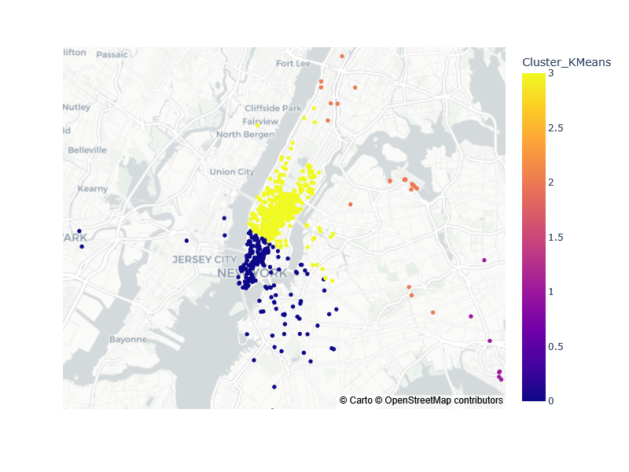
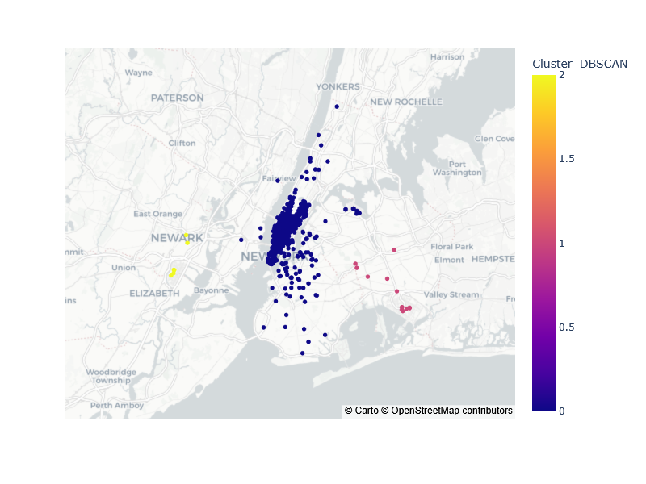

# Uber Pickups Project
* Unsupervised Machine Learning * 

[](http://forthebadge.com) [](https://forthebadge.com)


This is an unsupervised machine learning project, with clustering. The goal is to use different unsupervised ML to clustering the hot zone, to help the deployment of Uber cars where there is high needing.

## Getting Started

All the components of each step are in this [Notebook](Uber_Pickups_Project_YP.ipynb).
* Checking of the data
* Preprocessing
* Kmeans & DBSCAN for 1 day at a specific hour
* Kmeans & DBSCAN for generalized for day of week
* Conclusion between the 2 models

To the visualization of clustering, there are different maps than you can see in the directory `Graphes`.
The data used for this project is only on 1 month, because with all the data, it is to much computation to handle for my machine and with google collab too. Moreover, it is enough to see a clustering trend and to imagine a generalization for later. 

### Prerequisites

Things you need to run the codes:

```
python 3.12.1

pandas 
numpy
scikit-learn
plotly.express
plotly.graph_objects
```

### Some Results

Here are some maps examples obtained, for 1 day at 1 specific hour:

* For KMeans:



* For DBSCAN:



* Models comparison:

The 2 methods give clusters. But the Kmeans methode gives more distinguish cluster, the more there are points in one cluster the more it is a hot zone for the day of week. The DBSCAN method does one big cluster in the middle (due to the method based on the density of point) and few little clusters further.

In my opinion, for this project, I think the KMeans method is better to clustering zones to know where there is an high needing in uber cars.
## Acknowledgments

* Thanks for Jedha and its instructors for the lectures, exercises and all the work.


